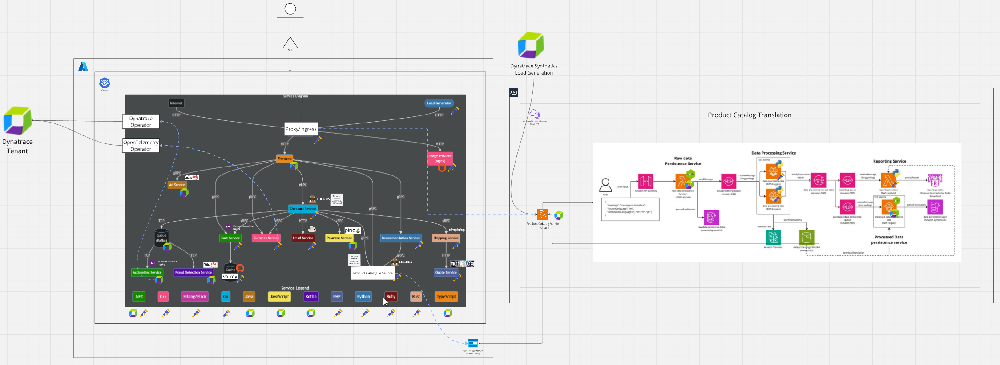

# Dynatrace Astronomy Shop and Cloud Native Demo

***[Link to Miro board](https://miro.com/app/board/uXjVK1IV6fg=/)***

***[Link to GitHub fork with PoC source code](https://github.com/keyoke/opentelemetry-demo/tree/features/dynatrace-demo)***

## Requirements

1. [Create AKS cluster](https://learn.microsoft.com/en-us/azure/aks/learn/quick-kubernetes-deploy-cli)
   - AKS requirements
      - nodegroups: 1
      - nodesize: D4s_v3
      - naming: astro-shop-cluster-0001
      - cni: AzureCNI
      - OS: ubuntu
      - [Enable Azure Blob storage CSI driver](https://learn.microsoft.com/en-us/azure/aks/learn/quick-kubernetes-deploy-cli)
2. [Create Azure Container Registry](https://learn.microsoft.com/en-us/azure/aks/tutorial-kubernetes-prepare-acr?tabs=azure-cli)
3. [Integrate ACR with AKS cluster](https://learn.microsoft.com/en-us/azure/aks/cluster-container-registry-integration?tabs=azure-cli)
    > This fails as we have restricted RBAC Role Assignments in our Dynatrace subscriptions
    > As temporary solution can use Access Key/Password.
    >
    > kubectl create secret docker-registry docker-registry-secret --docker-server=[ACR NAME].azurecr.io --docker-username=[ACR NAME] --docker-password=[ACR ACCESS KEY] --docker-email=test@test.com
4. Dynatrace Tenant

## Deploy Demo Target

1. [Install Dynatrace Operator](./dynatrace-operator/README.md)
1. [Install Opentelemetry Operator](./opentelemetry-operator/README.md)
1. [Install Opentelemetry Demo](./opentelemetry-demo-k8s/README.md)
1. [Deploy cloud-native](./cloud-native/README.md)

## Configure Demo Dynatrace Tenant

1. Enable OneAgent Features
   1. [Apache Kafka](https://www.dynatrace.com/hub/detail/apache-kafka/)
   2. [Redis/Valkey monitoring](https://www.dynatrace.com/hub/detail/redis/)
2. Add Service Detection Rules
   1. Frontend
   2. Ad Service
   3. Accounting Service
   4. Payment Service
